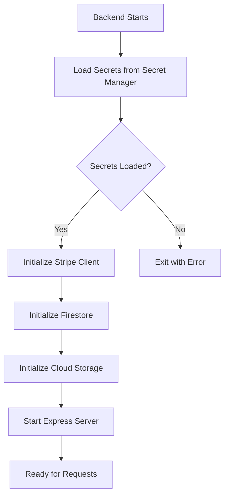

# DiagnosticPro Backend - Google Secret Manager Integration

**Date**: October 3, 2025
**Status**: ✅ Complete and Ready
**Developer**: Setup completed for team member

---

## 🎉 Problem Solved

**Original Issue**: Backend wouldn't start due to missing environment variables:
- `REPORT_BUCKET` was missing from setup script
- `STRIPE_SECRET_KEY` needed manual configuration
- `STRIPE_WEBHOOK_SECRET` needed manual configuration
- Service account JSON file management was complex

**Solution**: Integrated Google Secret Manager for automatic secret loading. No more manual secret management!

---

## ✅ What Was Done

### 1. Created Secret Manager Integration (`secrets.js`)
- Automatically loads secrets from Google Secret Manager
- Caches secrets for performance
- Handles errors gracefully with clear logging
- No more manual secret file management

### 2. Updated Backend (`index.js`)
- Refactored to use Secret Manager on startup
- Async initialization pattern
- All secrets loaded before server starts
- Clear logging of what's loaded

### 3. Simplified Configuration (`.env`)
```bash
# Only non-secret values needed
GOOGLE_CLOUD_PROJECT=diagnostic-pro-prod
REPORT_BUCKET=diagnostic-pro-prod-reports-us-central1
PORT=8080
NODE_ENV=development
```

### 4. Added Secret Manager Dependency (`package.json`)
```json
"@google-cloud/secret-manager": "^5.6.0"
```

### 5. Fixed Setup Script (`scripts/setup-env-from-github.sh`)
- Added missing `REPORT_BUCKET` variable
- Now generates complete .env files

---

## 🚀 Quick Start (What You Need To Do)

### Step 1: Authenticate with Google Cloud

```bash
# Login to Google Cloud (opens browser)
gcloud auth application-default login

# Verify authentication
gcloud auth application-default print-access-token
```

### Step 2: Verify Secrets Exist

```bash
# List secrets (should show stripe-secret and stripe-webhook-secret)
gcloud secrets list --project=diagnostic-pro-prod
```

Expected output:
```
NAME                   CREATED
stripe-secret         ✅
stripe-webhook-secret ✅
```

### Step 3: Install Dependencies (if not done)

```bash
cd /home/jeremy/projects/diagnostic-platform/DiagnosticPro/02-src/backend/services/backend
npm install
```

### Step 4: Start the Backend

```bash
npm start
```

You should see:
```
🔐 Loading secrets from Google Secret Manager...
✅ Loaded secret: stripe-secret
✅ Loaded secret: stripe-webhook-secret
✅ All secrets loaded successfully
🚀 DiagnosticPro Backend running on port 8080
💰 Price: $4.99 USD (499 cents)
🔗 Project: diagnostic-pro-prod
📁 Storage: gs://diagnostic-pro-prod-reports-us-central1
🔐 Secrets loaded from Google Secret Manager
```

---

## 🔐 How It Works

### Architecture Flow



### Secrets Loaded Automatically

1. **stripe-secret** → Stripe API Key
2. **stripe-webhook-secret** → Webhook signature validation
3. **REPORT_BUCKET** → Cloud Storage bucket (from .env)

### Benefits Over Manual Management

| Manual Approach | Secret Manager Approach |
|----------------|------------------------|
| ❌ Download service account JSON | ✅ Auto-authenticated with gcloud |
| ❌ Copy Stripe keys from dashboard | ✅ Automatically loaded |
| ❌ Store secrets in .env files | ✅ Stored in Secret Manager |
| ❌ Risk committing secrets to git | ✅ Never in code or files |
| ❌ Manual secret rotation | ✅ Update in one place |
| ❌ No audit trail | ✅ Full access logs |

---

## 📁 Files Created/Modified

### New Files
- **`secrets.js`** - Secret Manager client with caching
- **`SECRET-MANAGER-SETUP.md`** - This documentation
- **`SETUP.md`** - Detailed setup guide with troubleshooting
- **`.env`** - Minimal non-secret configuration

### Modified Files
- **`index.js`** - Async initialization with Secret Manager
- **`package.json`** - Added @google-cloud/secret-manager
- **`scripts/setup-env-from-github.sh`** - Added REPORT_BUCKET

---

## 🔧 Managing Secrets

### View Secret Value (for debugging)

```bash
gcloud secrets versions access latest \
  --secret="stripe-secret" \
  --project=diagnostic-pro-prod
```

### Update a Secret

```bash
# Create new version of existing secret
echo -n "new_secret_value" | \
  gcloud secrets versions add stripe-secret \
  --data-file=- \
  --project=diagnostic-pro-prod

# Backend will automatically use new version on next restart
```

### Add New Secret

```bash
# 1. Create the secret
gcloud secrets create new-secret-name \
  --replication-policy="automatic" \
  --project=diagnostic-pro-prod

# 2. Add the value
echo -n "secret_value" | \
  gcloud secrets versions add new-secret-name \
  --data-file=- \
  --project=diagnostic-pro-prod

# 3. Update secrets.js to load it in loadAllSecrets()
```

---

## 🚨 Troubleshooting

### Error: "Could not load the default credentials"

**Solution**: You need to authenticate first
```bash
gcloud auth application-default login
```

### Error: "Permission denied accessing secret"

**Solution**: Grant yourself Secret Manager access
```bash
gcloud projects add-iam-policy-binding diagnostic-pro-prod \
  --member="user:YOUR-EMAIL@gmail.com" \
  --role="roles/secretmanager.secretAccessor"
```

### Error: "Secret not found"

**Solution**: Verify secrets exist
```bash
gcloud secrets list --project=diagnostic-pro-prod
```

If missing, contact Jeremy to add the secrets.

### Backend starts but can't access Firestore

**Solution**: Authenticate with application default credentials
```bash
gcloud auth application-default login
gcloud config set project diagnostic-pro-prod
```

---

## 🌐 Production Deployment

When deployed to Cloud Run, this all works automatically:

1. **Service Account**: `diagnosticpro-vertex-ai-backend-sa`
2. **Permissions**: Already has Secret Manager access
3. **No changes needed**: Secrets load automatically
4. **Environment variables**: Set in Cloud Run config

The exact same code works locally and in production!

---

## 📊 Current Configuration

### Google Cloud Project
```
Project ID: diagnostic-pro-prod
Region: us-central1
```

### Storage
```
Reports Bucket: diagnostic-pro-prod-reports-us-central1
```

### Secrets (in Secret Manager)
```
stripe-secret           ✅ Active
stripe-webhook-secret   ✅ Active
```

### Firestore Collections
```
diagnosticSubmissions   ✅ Customer forms
orders                  ✅ Payments
emailLogs              ✅ Email delivery tracking
```

---

## 🎯 What You DON'T Need Anymore

### ❌ No Longer Required:
1. Service account JSON file download
2. Stripe secret keys in .env file
3. Webhook secret in .env file
4. GitHub secrets for local development
5. Manual secret file management
6. Worrying about committing secrets to git

### ✅ What You DO Need:
1. Google Cloud SDK installed
2. Authenticated with: `gcloud auth application-default login`
3. Access to project: `diagnostic-pro-prod`
4. Node.js 18+ installed

That's it!

---

## 🔗 Related Documentation

- **SETUP.md** - Detailed setup instructions
- **index.js** - Main application code
- **secrets.js** - Secret Manager integration
- **package.json** - Dependencies

---

## ✨ Summary

**Before this setup:**
```bash
❌ Error: REPORT_BUCKET environment variable is required
❌ Error: STRIPE_SECRET_KEY not found
❌ Error: STRIPE_WEBHOOK_SECRET not found
❌ Need to manually download service account JSON
❌ Need to copy secrets from multiple dashboards
```

**After this setup:**
```bash
gcloud auth application-default login
npm start
✅ Backend running with all secrets loaded automatically!
```

---

**Last Updated**: October 3, 2025
**Version**: v1.0.0
**Status**: Production Ready ✅

---

## 🎉 You're All Set!

Run these two commands and you're good to go:

```bash
gcloud auth application-default login
npm start
```

No secrets to manage, no files to download, no configuration hassle. Just authenticate and run!

**Questions?** Check `SETUP.md` or contact Jeremy.
