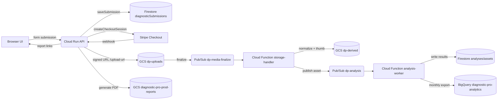
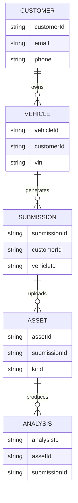

# DiagnosticPro ULTRATHINK Verification Report

_Generated: 2025-10-14_

## Project Brief
- Frontend (`02-src/frontend/src/src`) serves the Vite/React flow (`pages/Index.tsx → components/DiagnosticForm.tsx`) with Stripe checkout in the review step; no photo inputs ship on `main`.
- Backend Cloud Run API (`02-src/backend/services/backend/index.js:52-123`) handles `/saveSubmission`, `/createCheckoutSession`, PDF delivery, and Vertex AI analysis; it relies on `REPORT_BUCKET` and `STRIPE_SECRET_KEY` but still exposes the pre-upload rollout state.
- Feature branch `feature/photo-upload-identity-system` adds identity-aware submission handling (`handlers/saveSubmission.js`), signed upload URLs (`handlers/uploadUrl.js`), storage normalization (`services/storage-handler`), Gemini Vision analysis (`services/analysis-worker`), and a monthly BigQuery export script (`05-scripts/monthly-bigquery-export.sh`), none of which are deployed.
- Documentation (e.g., `README.md:44-53`, `CHANGELOG.md:1-80`, `01-docs/068-sum-deployment-status.md:17-152`) highlights the rollback and outstanding payment-flow decision. `CLAUDE.md` retains outdated Firebase/Supabase tooling guidance; `DEVELOPER-ONBOARDING.md` and incident files 0086–0090 are absent.
- Infra snapshot: `gcloud run services list` shows `diagnosticpro-vertex-ai-backend`, `diagnosticpro-stripe-webhook`, and legacy `simple-diagnosticpro`. `gs://dp-derived` and `gs://diagnostic-pro-prod-reports-us-central1` are readable and hardened; `gs://dp-uploads` denies `storage.buckets.get`. Pub/Sub topic `dp-analysis` exists, `dp-media-finalize` does not.

## Phase POR (0–4)
- **Phase 0 – Docs & flows**: ✅ State captured in README/CHANGELOG; ❌ Missing onboarding + incident docs.
- **Phase 1 – Infra inventory**: ✅ Derived/report buckets verified, Cloud Run enumerated; ❌ Upload bucket metadata inaccessible (403), `dp-media-finalize` topic missing.
- **Phase 2 – API & hooks**: ✅ Feature branch implements upload pipeline end-to-end; ❌ Mainline lacks `/upload-url`, storage handler, rate-limits, and UI capture paths.
- **Phase 3 – Payment gate**: ✅ Stripe webhook updates orders/submissions; ❌ No status ladder (`assets_ready → awaiting_payment → delivered`), teaser gating, or upload-first paywall logic.
- **Phase 4 – Analytics export**: ✅ Monthly export script + SQL live on feature branch; ❌ Pointing to `diagnostic-pro-start-up` instead of `diagnostic-pro-analytics`, IAM not wired.

## System Diagram

## Identity Graph

## Verification Checklist
- ✅ README / CLAUDE capture rollback + decision (`README.md:44-52`, `CLAUDE.md:7-33`).
- ❌ `DEVELOPER-ONBOARDING.md` & incident files 0086–0090 missing (`find . -name 'DEVELOPER-ONBOARDING.md'`, `rg --files -g '00{86,87,88,89,90}*'`).
- ✅ `gsutil ls -L -b gs://dp-derived` confirms Bucket Policy Only true and no lifecycle (`gsutil ls -L -b gs://dp-derived`).
- ✅ `gsutil ls -L -b gs://diagnostic-pro-prod-reports-us-central1` shows lifecycle policy.
- ❌ `gs://dp-uploads` metadata inaccessible (`gsutil ls -L -b gs://dp-uploads`, PAP/UBLA/lifecycle/CORS all 403).
- ❌ `gcloud pubsub topics describe dp-media-finalize --project diagnostic-pro-prod` → NOT_FOUND.
- ✅ `gcloud pubsub topics describe dp-analysis --project diagnostic-pro-prod` returns existing topic.
- ✅ `gcloud run services list --project diagnostic-pro-prod --region us-central1` inventories active services.
- ❌ `/upload-url` and photo inputs absent on main (`rg "/upload-url"` limited to docs; `rg "input type=\"file\"" 02-src/frontend/src/src`).
- ❌ Storage finalize + analysis worker only on feature branch (`git show feature/photo-upload-identity-system:02-src/backend/services/storage-handler/index.js`).
- ❌ Submission statuses remain `pending/processing/ready` (`02-src/backend/services/backend/index.js:90-139`), no paywall gating.
- ❌ Monthly export references `diagnostic-pro-start-up` project (`05-scripts/monthly-bigquery-export.sh:6-18`, `06-infrastructure/bigquery/03-identity-normalization.sql`).

## Gap Mitigation Plan (pending)
1. **Backend upload flow** – Merge `handlers/uploadUrl.js` & identity-aware save handler; add rate-limiting, status ladder (`intake → assets_pending → assets_ready → awaiting_payment → paid → delivered`), Stripe webhook unlock checks, and teaser gating across `index.js`, `handlers/stripe.js`, `handlers/payment.js`.
2. **Storage pipeline** – Deploy Cloud Functions (`services/storage-handler`, `services/analysis-worker`), provision Pub/Sub topics (`dp-media-finalize`, `dp-analysis`, DLQ) under `06-infrastructure/`, and ensure Firestore updates for assets/analyses.
3. **Frontend capture UX** – Introduce `PhotoUpload.tsx` and integrate into review step for upload-first UX, handle device capture, signed URL PUT, progress, and post-upload callbacks prior to payment.
4. **Analytics separation** – Repoint export script and SQL to `diagnostic-pro-analytics` datasets (`dp_stg`, `dp_prod`), update scheduler YAML, and document IAM bindings/service accounts.
5. **Documentation refresh** – Publish `DEVELOPER-ONBOARDING.md`, remove stale Supabase/Makefile references from `CLAUDE.md`, update README status, and cross-link `ULTRATHINK_REPORT.md`.
6. **Observability & guardrails** – Implement `/upload-url` throttling, DLQ handling for analysis errors, structured metrics for processing latency, and finalize `dp-uploads` CORS/PAP/lifecycle configuration.

## Blockers
- `storage.buckets.get` denied for `gs://dp-uploads`; need read access or a service account to confirm PAP/UBLA/CORS/lifecycle before rollout.
- Pub/Sub topic `dp-media-finalize` absent in `diagnostic-pro-prod`; must be created (plus subscriptions) or pipeline adjusted prior to deploying storage handler.
