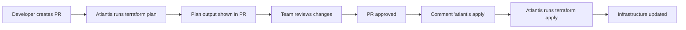

# Atlantis & Terragrunt Guide

**Purpose:** Comprehensive guide to Atlantis (GitOps for Terraform) and Terragrunt (DRY Terraform)
**Level:** Intermediate to Advanced
**Prerequisites:** Basic Terraform knowledge

---

## Table of Contents

1. [Atlantis - GitOps for Terraform](#atlantis---gitops-for-terraform)
2. [Terragrunt - DRY Terraform](#terragrunt---dry-terraform)
3. [Using Atlantis + Terragrunt Together](#using-atlantis--terragrunt-together)
4. [Real-World Implementation](#real-world-implementation)
5. [Best Practices](#best-practices)

---

## Atlantis - GitOps for Terraform

### What is Atlantis?

**Atlantis** is an open-source tool that brings GitOps workflows to Terraform by automating terraform commands through pull requests.

### Key Benefits
- **Pull Request Workflows:** See `terraform plan` output in PRs
- **Team Collaboration:** Review infrastructure changes before applying
- **Prevent Drift:** No more manual terraform runs
- **Audit Trail:** All changes tracked in Git history
- **Safety:** Apply only after code review and approval

### How Atlantis Works



### Installation Options

#### Option 1: Docker (Recommended)
```bash
# Run Atlantis with Docker
docker run -it --rm \
  -p 4141:4141 \
  -v $(pwd):/data \
  runatlantis/atlantis:latest \
  server \
  --gh-user="myuser" \
  --gh-token="ghp_token" \
  --gh-webhook-secret="webhook_secret" \
  --repo-allowlist="github.com/myorg/*"
```

#### Option 2: Kubernetes
```yaml
# atlantis-deployment.yaml
apiVersion: apps/v1
kind: Deployment
metadata:
  name: atlantis
spec:
  replicas: 1
  selector:
    matchLabels:
      app: atlantis
  template:
    metadata:
      labels:
        app: atlantis
    spec:
      containers:
      - name: atlantis
        image: runatlantis/atlantis:latest
        env:
        - name: ATLANTIS_GH_USER
          value: "myuser"
        - name: ATLANTIS_GH_TOKEN
          valueFrom:
            secretKeyRef:
              name: atlantis-secrets
              key: github-token
        - name: ATLANTIS_GH_WEBHOOK_SECRET
          valueFrom:
            secretKeyRef:
              name: atlantis-secrets
              key: webhook-secret
        - name: ATLANTIS_REPO_ALLOWLIST
          value: "github.com/myorg/*"
        ports:
        - containerPort: 4141
```

### Configuration

#### atlantis.yaml (Repository Level)
```yaml
# atlantis.yaml - Place in repo root
version: 3

projects:
- name: production
  dir: environments/prod
  terraform_version: v1.5.0
  apply_requirements: [approved, mergeable]
  workflow: custom

- name: staging
  dir: environments/staging
  terraform_version: v1.5.0
  apply_requirements: [mergeable]

workflows:
  custom:
    plan:
      steps:
      - env:
          name: TF_VAR_environment
          value: prod
      - init
      - plan:
          extra_args: ["-var-file", "prod.tfvars"]
    apply:
      steps:
      - env:
          name: TF_VAR_environment
          value: prod
      - apply
```

#### Server Configuration
```yaml
# server.yaml - Atlantis server config
repos:
- id: github.com/myorg/terraform-infrastructure
  allowed_overrides: [apply_requirements, workflow]
  allow_custom_workflows: true

workflows:
  default:
    plan:
      steps:
      - init
      - plan
    apply:
      steps:
      - apply

# Require approval for production
apply_requirements: [approved]

# Only allow specific users to apply
allowed_regexp: "^(user1|user2|admin)$"
```

### Atlantis Commands

#### In Pull Request Comments:
```bash
# Plan specific project
atlantis plan -p production

# Plan with extra args
atlantis plan -p staging -- -var="instance_count=3"

# Apply after approval
atlantis apply -p production

# Apply all projects
atlantis apply

# Unlock if stuck
atlantis unlock

# Show help
atlantis help
```

### GitHub Integration

#### 1. Create GitHub App
```bash
# Create webhook URL
https://your-atlantis-server.com/events

# Required permissions:
# - Repository: Read & Write
# - Pull requests: Read & Write
# - Commit statuses: Read & Write
# - Issues: Read & Write (for comments)
```

#### 2. Webhook Configuration
```json
{
  "url": "https://your-atlantis-server.com/events",
  "content_type": "application/json",
  "secret": "your-webhook-secret",
  "events": [
    "pull_request",
    "push",
    "pull_request_review",
    "issue_comment"
  ]
}
```

### Security Features

#### Access Control
```yaml
# Only allow specific repositories
repos:
- id: github.com/myorg/infrastructure
  apply_requirements: [approved]

- id: github.com/myorg/applications
  apply_requirements: [mergeable]
  allowed_overrides: [workflow]
```

#### Pre-Workflow Hooks
```yaml
# Run security scans before plan
pre_workflow_hooks:
- run: |
    echo "Running security scan..."
    tfsec .
    echo "Security scan complete"
```

#### Post-Workflow Hooks
```yaml
# Notify after apply
post_workflow_hooks:
- run: |
    echo "Deployment complete, notifying Slack..."
    curl -X POST -H 'Content-type: application/json' \
      --data '{"text":"Infrastructure updated in production"}' \
      $SLACK_WEBHOOK_URL
```

---

## Terragrunt - DRY Terraform

### What is Terragrunt?

**Terragrunt** is a thin wrapper for Terraform that provides extra tools for keeping your Terraform configurations **DRY (Don't Repeat Yourself)**.

### Key Benefits
- **DRY Configurations:** Eliminate duplicate code across environments
- **Remote State Management:** Automatic backend configuration
- **Dependency Management:** Handle dependencies between Terraform modules
- **Variable Management:** Hierarchical variable inheritance
- **Before/After Hooks:** Run commands before and after Terraform

### Terragrunt vs Plain Terraform

#### Without Terragrunt (Repetitive)
```
terraform/
├── dev/
│   ├── main.tf          # Duplicate code
│   ├── variables.tf     # Duplicate code
│   ├── backend.tf       # Duplicate backend config
│   └── terraform.tfvars
├── staging/
│   ├── main.tf          # Duplicate code
│   ├── variables.tf     # Duplicate code
│   ├── backend.tf       # Duplicate backend config
│   └── terraform.tfvars
└── prod/
    ├── main.tf          # Duplicate code
    ├── variables.tf     # Duplicate code
    ├── backend.tf       # Duplicate backend config
    └── terraform.tfvars
```

#### With Terragrunt (DRY)
```
terragrunt/
├── modules/
│   └── infrastructure/
│       ├── main.tf      # Single source of truth
│       ├── variables.tf
│       └── outputs.tf
├── dev/
│   └── terragrunt.hcl   # Environment-specific config
├── staging/
│   └── terragrunt.hcl   # Environment-specific config
└── prod/
    └── terragrunt.hcl   # Environment-specific config
```

### Basic Terragrunt Configuration

#### terragrunt.hcl (Environment Level)
```hcl
# dev/terragrunt.hcl
terraform {
  source = "../modules/infrastructure"
}

# Remote state configuration
remote_state {
  backend = "gcs"

  config = {
    bucket = "mycompany-terraform-state"
    prefix = "dev/infrastructure"
  }

  generate = {
    path      = "backend.tf"
    if_exists = "overwrite"
  }
}

# Input variables
inputs = {
  environment    = "dev"
  project_id     = "mycompany-dev"
  instance_type  = "n1-standard-1"
  min_replicas   = 1
  max_replicas   = 3
}
```

#### prod/terragrunt.hcl
```hcl
# prod/terragrunt.hcl
terraform {
  source = "../modules/infrastructure"
}

remote_state {
  backend = "gcs"

  config = {
    bucket = "mycompany-terraform-state"
    prefix = "prod/infrastructure"
  }

  generate = {
    path      = "backend.tf"
    if_exists = "overwrite"
  }
}

inputs = {
  environment    = "prod"
  project_id     = "mycompany-prod"
  instance_type  = "n1-standard-4"
  min_replicas   = 3
  max_replicas   = 10
}
```

### Hierarchical Configuration

#### Root terragrunt.hcl
```hcl
# terragrunt.hcl (root level)
remote_state {
  backend = "gcs"

  config = {
    bucket = "mycompany-terraform-state"
    prefix = "${path_relative_to_include()}"
  }

  generate = {
    path      = "backend.tf"
    if_exists = "overwrite"
  }
}

# Generate provider configuration
generate "provider" {
  path      = "provider.tf"
  if_exists = "overwrite_terragrunt"
  contents  = <<EOF
provider "google" {
  project = var.project_id
  region  = var.region
}
EOF
}

# Common inputs inherited by all environments
inputs = {
  region = "us-central1"
}
```

#### Environment-specific Configuration
```hcl
# dev/terragrunt.hcl
include "root" {
  path = find_in_parent_folders()
}

terraform {
  source = "../modules/infrastructure"
}

inputs = {
  environment   = "dev"
  project_id    = "mycompany-dev"
  instance_type = "n1-standard-1"
  # region inherited from root
}
```

### Dependencies Between Modules

#### Module Dependencies
```hcl
# database/terragrunt.hcl
include "root" {
  path = find_in_parent_folders()
}

terraform {
  source = "../../modules/database"
}

inputs = {
  environment = "prod"
  project_id  = "mycompany-prod"
}
```

```hcl
# application/terragrunt.hcl
include "root" {
  path = find_in_parent_folders()
}

terraform {
  source = "../../modules/application"
}

# Depend on database module
dependency "database" {
  config_path = "../database"

  mock_outputs = {
    database_url = "mock-database-url"
  }

  mock_outputs_allowed_terraform_commands = ["plan", "validate"]
}

inputs = {
  environment  = "prod"
  project_id   = "mycompany-prod"
  database_url = dependency.database.outputs.database_url
}
```

### Before/After Hooks

#### Pre-execution Hooks
```hcl
# terragrunt.hcl
terraform {
  before_hook "validate_vars" {
    commands = ["plan", "apply"]
    execute  = ["./scripts/validate-vars.sh"]
  }

  before_hook "check_costs" {
    commands = ["apply"]
    execute  = ["./scripts/cost-check.sh"]
  }
}
```

#### Post-execution Hooks
```hcl
terraform {
  after_hook "notify_slack" {
    commands     = ["apply"]
    execute      = ["./scripts/notify-slack.sh", "Deployment complete"]
    run_on_error = false
  }

  after_hook "cleanup" {
    commands = ["apply", "destroy"]
    execute  = ["./scripts/cleanup.sh"]
  }
}
```

### Terragrunt Commands

```bash
# Initialize all modules
terragrunt run-all init

# Plan all modules
terragrunt run-all plan

# Apply all modules
terragrunt run-all apply

# Apply specific module
cd dev/database
terragrunt apply

# Apply with dependencies
terragrunt apply-all

# Destroy everything (be careful!)
terragrunt run-all destroy

# Validate configurations
terragrunt run-all validate

# Format all .tf files
terragrunt run-all fmt
```

---

## Using Atlantis + Terragrunt Together

### Why Combine Them?

- **Atlantis:** GitOps workflow and team collaboration
- **Terragrunt:** DRY configurations and dependency management
- **Together:** Best of both worlds - clean configs + safe deployments

### Configuration

#### atlantis.yaml for Terragrunt
```yaml
# atlantis.yaml
version: 3

projects:
- name: dev-infrastructure
  dir: dev
  terraform_version: v1.5.0
  apply_requirements: [mergeable]
  workflow: terragrunt

- name: prod-infrastructure
  dir: prod
  terraform_version: v1.5.0
  apply_requirements: [approved, mergeable]
  workflow: terragrunt

workflows:
  terragrunt:
    plan:
      steps:
      - env:
          name: TERRAGRUNT_WORKING_DIR
          command: pwd
      - run: terragrunt plan --terragrunt-non-interactive
    apply:
      steps:
      - env:
          name: TERRAGRUNT_WORKING_DIR
          command: pwd
      - run: terragrunt apply --terragrunt-non-interactive
```

#### Directory Structure
```
infrastructure/
├── atlantis.yaml
├── terragrunt.hcl          # Root config
├── modules/
│   ├── vpc/
│   ├── database/
│   └── application/
├── dev/
│   ├── vpc/
│   │   └── terragrunt.hcl
│   ├── database/
│   │   └── terragrunt.hcl
│   └── application/
│       └── terragrunt.hcl
└── prod/
    ├── vpc/
    │   └── terragrunt.hcl
    ├── database/
    │   └── terragrunt.hcl
    └── application/
        └── terragrunt.hcl
```

### Workflow Example

1. **Developer creates PR** with Terragrunt config changes
2. **Atlantis triggers** and runs `terragrunt plan`
3. **Plan output** shows in PR comments
4. **Team reviews** infrastructure changes
5. **PR approved** and merged
6. **Comment `atlantis apply`** triggers `terragrunt apply`
7. **Infrastructure deployed** with proper dependencies

---

## Real-World Implementation

### DiagnosticPro Example

#### Project Structure
```
diagnosticpro-infrastructure/
├── atlantis.yaml
├── terragrunt.hcl
├── modules/
│   ├── database/
│   ├── storage/
│   ├── cloud-run/
│   └── media-processing/
├── dev/
│   ├── database/terragrunt.hcl
│   ├── storage/terragrunt.hcl
│   ├── cloud-run/terragrunt.hcl
│   └── media-processing/terragrunt.hcl
└── prod/
    ├── database/terragrunt.hcl
    ├── storage/terragrunt.hcl
    ├── cloud-run/terragrunt.hcl
    └── media-processing/terragrunt.hcl
```

#### Root Configuration
```hcl
# terragrunt.hcl (root)
remote_state {
  backend = "gcs"

  config = {
    bucket = "diagnostic-pro-prod-terraform-state"
    prefix = "${path_relative_to_include()}"
  }

  generate = {
    path      = "backend.tf"
    if_exists = "overwrite"
  }
}

generate "provider" {
  path      = "provider.tf"
  if_exists = "overwrite_terragrunt"
  contents  = <<EOF
provider "google" {
  project = var.project_id
  region  = var.region
}

provider "google-beta" {
  project = var.project_id
  region  = var.region
}
EOF
}

inputs = {
  region = "us-central1"
}
```

#### Production Database
```hcl
# prod/database/terragrunt.hcl
include "root" {
  path = find_in_parent_folders()
}

terraform {
  source = "../../modules/database"
}

inputs = {
  project_id      = "diagnostic-pro-prod"
  environment     = "prod"
  instance_name   = "diagnosticpro-db"
  database_version = "POSTGRES_15"
  tier            = "db-n1-standard-1"  # Production tier
}
```

#### Production Storage (depends on database)
```hcl
# prod/storage/terragrunt.hcl
include "root" {
  path = find_in_parent_folders()
}

terraform {
  source = "../../modules/storage"
}

dependency "database" {
  config_path = "../database"
}

inputs = {
  project_id = "diagnostic-pro-prod"
  environment = "prod"

  buckets = {
    media_uploads = {
      name = "diagnostic-pro-prod-media-uploads"
      location = "US"
    }
    processed_media = {
      name = "diagnostic-pro-prod-processed-media"
      location = "US"
    }
  }
}
```

### Atlantis Workflow for DiagnosticPro

#### atlantis.yaml
```yaml
version: 3

projects:
- name: prod-database
  dir: prod/database
  apply_requirements: [approved, mergeable]
  workflow: terragrunt-prod

- name: prod-storage
  dir: prod/storage
  apply_requirements: [approved, mergeable]
  workflow: terragrunt-prod

- name: dev-database
  dir: dev/database
  apply_requirements: [mergeable]
  workflow: terragrunt-dev

workflows:
  terragrunt-prod:
    plan:
      steps:
      - run: |
          echo "Planning production infrastructure..."
          terragrunt plan --terragrunt-non-interactive
    apply:
      steps:
      - run: |
          echo "Applying production infrastructure..."
          terragrunt apply --terragrunt-non-interactive
          echo "Deployment complete!"

  terragrunt-dev:
    plan:
      steps:
      - run: terragrunt plan --terragrunt-non-interactive
    apply:
      steps:
      - run: terragrunt apply --terragrunt-non-interactive
```

---

## Best Practices

### 1. Repository Organization
```
# Separate infrastructure from application code
infrastructure/           # This repo
├── atlantis.yaml
├── terragrunt.hcl
├── modules/
└── environments/

application/              # Separate repo
├── src/
├── Dockerfile
└── .github/workflows/
```

### 2. Security
```yaml
# Restrict Atlantis access
repos:
- id: github.com/company/infrastructure
  apply_requirements: [approved]
  allowed_overrides: []

# Use RBAC
allowed_regexp: "^(devops-team|platform-engineers)$"
```

### 3. State Management
```hcl
# Separate state files by service/environment
remote_state {
  backend = "gcs"
  config = {
    bucket = "company-terraform-state"
    prefix = "${local.environment}/${local.service}"
  }
}
```

### 4. Testing
```bash
# Test with Terragrunt
terragrunt validate
terragrunt plan

# Test with atlantis
atlantis plan -p dev-database
```

### 5. Monitoring
```yaml
# Add monitoring hooks
terraform {
  after_hook "monitor" {
    commands = ["apply"]
    execute = [
      "curl", "-X", "POST",
      "https://monitoring.company.com/deployments",
      "-d", "{\"service\": \"${get_env(\"TG_SERVICE\", \"unknown\")}\"}"
    ]
  }
}
```

---

## Conclusion

### When to Use What

#### Use Atlantis When:
- Team needs to collaborate on infrastructure
- Want GitOps workflow for Terraform
- Need approval process for production changes
- Want audit trail of all infrastructure changes

#### Use Terragrunt When:
- Have multiple environments (dev/staging/prod)
- Tired of duplicating Terraform code
- Need complex dependency management
- Want better remote state organization

#### Use Both When:
- Want the best of both worlds
- Have enterprise requirements
- Need scalable infrastructure management
- Team is comfortable with both tools

### Getting Started

1. **Start with Terraform basics**
2. **Add Terragrunt for DRY configs**
3. **Introduce Atlantis for team collaboration**
4. **Iterate and improve processes**

Both tools significantly improve Terraform workflows, but require investment in learning and setup. Start simple and gradually add complexity as your team grows comfortable with the tools.

---

*This guide provides a foundation for using Atlantis and Terragrunt. Continue learning through hands-on practice and adapt these patterns to your specific use cases.*