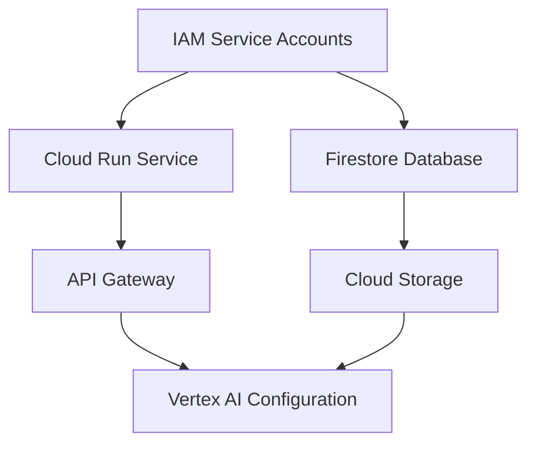

# Terraform Migration Assessment - DiagnosticPro Platform

**Date:** October 2, 2025
**Platform:** DiagnosticPro AI Equipment Diagnostics
**Current Status:** Production Live System ($4.99/diagnostic)
**Assessment Lead:** DevOps Infrastructure Analysis

---

## Executive Summary

DiagnosticPro is a **LIVE PRODUCTION SYSTEM** serving real customers with AI-powered equipment diagnostics. The platform currently uses manual GCP console management and Firebase CLI deployments. This assessment recommends a **phased Terraform migration** to improve infrastructure reliability, scalability, and team collaboration.

---

## Current Infrastructure Discovery

### 1. Infrastructure Management
**Current State:** **D. Mix of manual and CLI approaches**
- Firebase CLI for frontend/functions deployment
- GCP Console for Cloud Run, IAM, and infrastructure
- Manual Stripe webhook configuration
- No Infrastructure as Code (IaC) currently

### 2. GCP Project Structure
- **Primary Project:** `diagnostic-pro-prod` (Project ID: 298932670545)
- **Organization:** Individual Google account (not enterprise org)
- **Environment Separation:** Single production project (no dev/staging separation)
- **Domain:** `diagnosticpro.io` (Firebase custom domain)

### 3. Compute Resources
**Current Usage:** **C. Cloud Run + D. Cloud Functions**

**Production Services:**
- **Cloud Run:** `diagnosticpro-vertex-ai-backend` (us-central1)
  - Node.js Express API with Vertex AI integration
  - Handles $4.99 Stripe payments and PDF generation
- **Firebase Cloud Functions:** Frontend deployment and hosting
- **Firebase Hosting:** React frontend (`diagnosticpro.io`)

### 4. Networking
**Current Configuration:**
- **Default VPC:** Using GCP default network
- **API Gateway:** `diagpro-gw-3tbssksx` (public webhook endpoint)
- **Load Balancing:** Firebase CDN for frontend, Cloud Run internal LB
- **Firewall:** Default rules + API Gateway access controls
- **Complexity:** Simple (default network + API gateway)

### 5. Data & Storage
**Current Stack:** **C. Firestore + E. Cloud Storage**

**Production Data:**
- **Firestore Database:** 3 collections (diagnosticSubmissions, orders, emailLogs)
- **Cloud Storage:** PDF report storage with signed URLs
- **No SQL databases:** All data in Firestore NoSQL
- **No BigQuery:** (Analytics in separate diagnostic-platform project)

### 6. Security & IAM
**Current Setup:**
- **Service Account:** `diagnosticpro-vertex-ai-backend-sa`
- **IAM Roles:** Basic Firebase admin + Cloud Run invoker + Vertex AI user
- **Secrets:** GitHub secrets for environment variables
- **Custom Roles:** None (using predefined roles)
- **VPC Service Controls:** Not implemented

### 7. Monitoring & Operations
- **Firebase Console:** Basic hosting analytics
- **Cloud Run Logs:** Application logging
- **Vertex AI Monitoring:** Default GCP monitoring
- **Alerting:** Not implemented
- **Uptime Checks:** Not configured

### 8. CI/CD & Automation
- **Deployment:** Manual Firebase CLI (`firebase deploy`)
- **Source Control:** GitHub (`jeremylongshore/DiagnosticPro`)
- **Build Process:** Local builds + manual deployment
- **Cloud Build:** Not implemented

---

## Migration Scope Assessment

### 9. Terraforming Strategy
**Recommendation:** **C. Specific projects with incremental expansion**

**Phase 1 (Immediate):** Infrastructure foundation
- Cloud Run services
- IAM service accounts and roles
- API Gateway configuration
- Firestore database settings

**Phase 2 (Future):** Advanced features
- Cloud Functions (when needed)
- Monitoring and alerting
- Multiple environments (dev/staging)

### 10. Resources to Remain Outside Terraform
**Keep Manual:**
- Firebase Hosting (integrated with Firebase CLI workflow)
- Domain configuration (Firebase custom domains)
- GitHub secrets (managed through GitHub CLI)
- Stripe webhook configuration (external service)

### 11. Migration Timeline
**Recommendation:** **B. Phased over 1-3 months**

**Phase 1:** Foundation (2 weeks)
**Phase 2:** Production migration (2 weeks)
**Phase 3:** Monitoring & optimization (4 weeks)

### 12. Risk Tolerance
**Assessment:** **A. Zero-downtime required**

**Critical Considerations:**
- Live revenue-generating system ($4.99/diagnostic)
- Real customer payments processing
- Cannot afford production outages
- Must maintain Firestore data integrity

---

## Technical Requirements Assessment

### 13. Terraform Experience Level
**Current Team:** **C. Beginner (limited exposure)**
- Requires comprehensive documentation
- Step-by-step migration procedures
- Clear rollback plans

### 14. State Backend Preference
**Recommendation:** **A. GCS bucket**
- Native GCP integration
- Automatic versioning and locking
- Bucket: `diagnostic-pro-prod-terraform-state`

### 15. Module Structure Preference
**Recommendation:** **D. Layered approach**
```
Layer 1: Foundation (networking, IAM)
Layer 2: Services (Cloud Run, Firestore)
Layer 3: Applications (API configurations)
```

### 16. Version Constraints
**Standards:**
- **Terraform:** >= 1.5.0 (latest stable)
- **Google Provider:** ~> 5.0 (current stable)
- **Compatibility:** No organizational constraints

### 17. Naming Conventions
**Existing Patterns to Preserve:**
- `diagnostic-pro-prod` project naming
- `diagnosticpro-vertex-ai-backend` service naming
- Maintain consistency with current Firebase naming

---

## Risk Assessment Matrix

### 🔴 HIGH RISK (Zero-Downtime Required)

| Resource | Risk Level | Migration Strategy |
|----------|------------|-------------------|
| **Firestore Database** | CRITICAL | Import only - preserve all data |
| **Cloud Run Backend** | HIGH | Import + careful deployment testing |
| **API Gateway** | HIGH | Import - handles $4.99 payments |
| **Service Accounts** | HIGH | Import - handles authentication |

### 🟡 MEDIUM RISK (Maintenance Window Acceptable)

| Resource | Risk Level | Migration Strategy |
|----------|------------|-------------------|
| **IAM Bindings** | MEDIUM | Import + validate permissions |
| **Cloud Storage Buckets** | MEDIUM | Import - contains PDF reports |
| **Vertex AI Configurations** | MEDIUM | Import + test AI functionality |

### 🟢 LOW RISK (Safe to Recreate)

| Resource | Risk Level | Migration Strategy |
|----------|------------|-------------------|
| **Monitoring Policies** | LOW | Create new (currently minimal) |
| **Logging Configurations** | LOW | Create new with best practices |
| **Network Rules** | LOW | Recreate (using defaults) |

---

## Infrastructure Inventory

### Current GCP Resources (Production)

```yaml
Cloud Run Services:
  - diagnosticpro-vertex-ai-backend:
      region: us-central1
      runtime: Node.js 18
      memory: 2Gi
      cpu: 2
      min_instances: 0
      max_instances: 100

API Gateway:
  - diagpro-gw-3tbssksx:
      type: managed
      endpoint: diagpro-gw-3tbssksx-3tbssksx.uc.gateway.dev

Firestore:
  - mode: native
    location: us-central
    collections: [diagnosticSubmissions, orders, emailLogs]

Cloud Storage:
  - bucket: diagnostic-pro-prod.firebasestorage.app
    purpose: PDF report storage
    access: signed URLs

IAM Service Accounts:
  - diagnosticpro-vertex-ai-backend-sa:
      roles:
        - Firestore User
        - Cloud Run Invoker
        - Vertex AI User
        - Storage Object Admin

Vertex AI:
  - model: gemini-2.5-flash
    region: us-central1
    purpose: diagnostic analysis
```

---

## Migration Dependencies

### Critical Path Analysis



**Import Order:**
1. **IAM Service Accounts** (foundation)
2. **Firestore Database** (data layer)
3. **Cloud Storage Buckets** (file storage)
4. **Cloud Run Services** (application layer)
5. **API Gateway** (public interface)
6. **Vertex AI Settings** (AI integration)

---

## Effort Estimation

### Phase 1: Foundation Setup (Week 1-2)
- **Effort:** 16-24 hours
- **Tasks:** Terraform setup, state backend, basic modules
- **Risk:** Low
- **Deliverables:** Working Terraform configuration

### Phase 2: Resource Import (Week 3-4)
- **Effort:** 24-32 hours
- **Tasks:** Import existing resources, validate configurations
- **Risk:** Medium
- **Deliverables:** All resources under Terraform management

### Phase 3: Optimization (Week 5-8)
- **Effort:** 16-24 hours
- **Tasks:** Add monitoring, improve modules, documentation
- **Risk:** Low
- **Deliverables:** Production-ready infrastructure

**Total Estimated Effort:** 56-80 hours (7-10 days)

---

## Business Impact Assessment

### Revenue Protection
- **Current Revenue:** $4.99 per diagnostic
- **Monthly Volume:** Unknown (customer-dependent)
- **Downtime Cost:** Direct revenue loss + customer trust impact
- **Migration Benefit:** Improved reliability, faster deployments

### Operational Benefits
- **Infrastructure as Code:** Version-controlled infrastructure
- **Team Collaboration:** Shared infrastructure understanding
- **Disaster Recovery:** Reproducible infrastructure
- **Scaling Preparation:** Foundation for multi-environment setup

---

## Success Criteria

### Technical Criteria
- [ ] All production resources imported without drift
- [ ] `terraform plan` shows zero unintended changes
- [ ] Rollback procedure tested and documented
- [ ] State locking and versioning functional
- [ ] Team trained on Terraform workflow

### Business Criteria
- [ ] Zero production downtime during migration
- [ ] All $4.99 payment processing maintained
- [ ] PDF report generation continues uninterrupted
- [ ] Customer experience unchanged
- [ ] Improved deployment reliability

---

## Next Steps

1. **Review and Approve Assessment** (1 day)
2. **Set up Terraform Development Environment** (2 days)
3. **Create Migration Plan Document** (1 day)
4. **Begin Phase 1 Implementation** (2 weeks)

---

**Assessment Status:** ✅ COMPLETE
**Recommendation:** PROCEED with phased Terraform migration
**Next Document:** `migration-plan.md`

---

*This assessment identifies DiagnosticPro as an excellent candidate for Terraform migration with careful attention to zero-downtime requirements and revenue protection.*