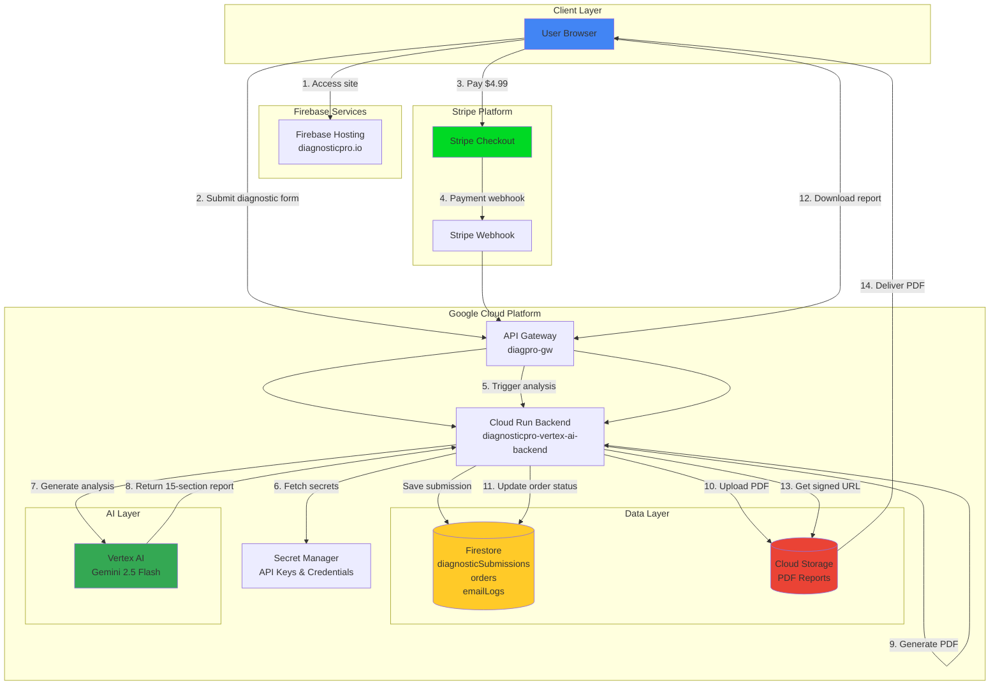

# DiagnosticPro – AI-Powered Equipment Diagnostic Reports

<div align="center">

[](https://diagnosticpro.io)
[](https://firebase.google.com)
[](https://cloud.google.com/vertex-ai)
[](LICENSE)

**Get professional AI-assisted diagnostic reports for vehicles and equipment — Just $4.99**

Quick, affordable, AI-powered analysis to help you understand equipment problems before visiting a repair shop.

[Try It Now](https://diagnosticpro.io) • [How It Works](#-how-it-works-for-users) • [For Developers](#-technical-overview)

</div>

---

## What DiagnosticPro Does

DiagnosticPro transforms confusing equipment problems into clear, professional diagnostic reports you can take to any repair shop—or use to fix issues yourself.

**Who It's For:**
- 🚗 **Vehicle owners** dealing with check-engine lights or warning codes
- 🔧 **Equipment operators** troubleshooting machinery or electronics
- 💰 **Anyone** who wants clarity and confidence before paying for repairs
- 🛡️ **People** concerned about being overcharged or misled by shops

**What Problem It Solves:**
- Eliminates confusion when equipment malfunctions
- Provides clear next steps and likely causes
- Arms you with technical knowledge for shop conversations
- Identifies potential scams and overcharges before they happen

**What You Get:**
- 📄 **12-15 page professional PDF report** with comprehensive analysis
- 🎯 **Likely causes** ranked by probability with confidence percentages
- 🗣️ **Conversation scripts** for talking to repair shops
- ❓ **5 technical questions** to ask mechanics to verify their competence
- 💵 **Cost breakdowns** showing fair pricing vs. overcharges
- 🔍 **Scam detection** identifying common repair shop tricks
- ⚙️ **Technical education** explaining how your equipment actually works
- 🔗 **Source verification** with links to manufacturer documentation

**Price:** $4.99 per diagnostic report — delivered in minutes

---

## 🚀 How It Works for Users

Getting your diagnostic report is simple and fast:

### Step-by-Step

1. **Visit [diagnosticpro.io](https://diagnosticpro.io)** and fill out the diagnostic form
   - Equipment type (vehicle, machinery, electronics, etc.)
   - Symptoms and warning lights
   - Any diagnostic codes (optional but helpful)

2. **Review your submission** and confirm details are correct

3. **Pay securely via Stripe** — just $4.99, one-time payment

4. **AI analyzes your submission** — powered by Google Vertex AI Gemini 2.5 Flash
   - Processes symptoms against vast repair database
   - Generates 15-section comprehensive analysis
   - Creates professional PDF report (12-15 pages)

5. **Download your report** — arrives via email in minutes
   - Instant access with secure download link
   - Keep forever, share with mechanics, or print

### User Journey Diagram


**Total Time:** 2-3 minutes to submit + ~5 minutes for AI analysis = **Report in your inbox in under 10 minutes**

---

## 🎯 What's In Your Report

Every DiagnosticPro report includes our proprietary **15-section analysis framework**:

### The 15 Sections

| Section | What You Get |
|---------|-------------|
| 1️⃣ **PRIMARY DIAGNOSIS** | Most likely root cause with confidence percentage |
| 2️⃣ **DIFFERENTIAL DIAGNOSIS** | Alternative causes ranked by likelihood |
| 3️⃣ **DIAGNOSTIC VERIFICATION** | Exact tests the shop should perform |
| 4️⃣ **SHOP INTERROGATION** | 5 technical questions to expose incompetence |
| 5️⃣ **CONVERSATION SCRIPTING** | Word-for-word guidance for talking to mechanics |
| 6️⃣ **COST BREAKDOWN** | Fair pricing vs. overcharge identification |
| 7️⃣ **RIPOFF DETECTION** | Common scam patterns and red flags |
| 8️⃣ **AUTHORIZATION GUIDE** | Which repairs to approve/reject/get second opinions on |
| 9️⃣ **TECHNICAL EDUCATION** | How your equipment works and why it failed |
| 🔟 **OEM PARTS STRATEGY** | Specific part numbers and sourcing recommendations |
| 1️⃣1️⃣ **NEGOTIATION TACTICS** | Professional strategies for price discussions |
| 1️⃣2️⃣ **LIKELY CAUSES** | Complete ranked list with confidence levels |
| 1️⃣3️⃣ **RECOMMENDATIONS** | Immediate actions and preventive maintenance |
| 1️⃣4️⃣ **SOURCE VERIFICATION** | Links to TSBs, recalls, manufacturer documentation |
| 1️⃣5️⃣ **ROOT CAUSE ANALYSIS** | Deep dive into underlying failure mechanisms |

**Total:** 2000+ words of professional analysis tailored to your specific equipment problem

---

## 💡 Why DiagnosticPro?

### vs. Asking Friends
❌ Friends guess based on limited experience
✅ **DiagnosticPro** analyzes thousands of similar cases with AI

### vs. Going to the Shop Blind
❌ You have no leverage or technical knowledge
✅ **DiagnosticPro** arms you with questions and red flags

### vs. Online Forums
❌ Conflicting advice from random people
✅ **DiagnosticPro** provides structured, sourced analysis

### vs. Expensive Diagnostic Fees
❌ Shops charge $100-150 just for diagnosis
✅ **DiagnosticPro** costs $4.99 and you can use it anywhere

---

## 🏗️ Technical Overview

> **For Developers:** This section explains the system architecture and tech stack.

### Tech Stack

| Layer | Technology | Purpose |
|-------|-----------|---------|
| **Frontend** | React 18 + TypeScript + Vite | User-facing web app at diagnosticpro.io |
| **Hosting** | Firebase Hosting | Static site delivery with custom domain |
| **UI Framework** | shadcn/ui + Tailwind CSS | Professional component library |
| **Backend** | Node.js 18 + Express | Cloud Run service handling business logic |
| **API Gateway** | Google Cloud API Gateway | Route management and rate limiting |
| **AI Engine** | Vertex AI Gemini 2.5 Flash | 15-section diagnostic analysis generation |
| **Payments** | Stripe Checkout + Webhooks | Secure $4.99 one-time payments |
| **Database** | Cloud Firestore | Real-time NoSQL for submissions and orders |
| **File Storage** | Google Cloud Storage | PDF report storage with signed URLs |
| **Secrets** | Google Secret Manager | Encrypted credential management |
| **Deployment** | Cloud Run + Firebase | Fully managed, auto-scaling infrastructure |

### System Architecture



### Data Flow

**Complete Request Lifecycle:**

```
1. USER submits diagnostic form
   └─> POST /saveSubmission via API Gateway
       └─> Cloud Run saves to Firestore (diagnosticSubmissions collection)
       └─> Returns submissionId to frontend

2. USER completes Stripe Checkout
   └─> Stripe creates checkout session ($4.99)
       └─> Payment succeeds
           └─> Stripe fires checkout.session.completed webhook

3. Stripe webhook hits API Gateway
   └─> POST /stripeWebhook with signature verification
       └─> Cloud Run validates webhook signature
           └─> Creates order in Firestore (orders collection)
           └─> Triggers AI analysis

4. Cloud Run calls Vertex AI
   └─> Loads submission data from Firestore
       └─> Sends to Gemini 2.5 Flash with 15-section prompt
           └─> Receives 2000+ word structured analysis (20-30s)

5. Cloud Run generates PDF
   └─> PDFValidationSystem validates all 15 sections
       └─> Typography manager formats with proper pagination
           └─> Generates 12-15 page professional PDF
               └─> Uploads to Cloud Storage bucket

6. Cloud Run sends email
   └─> Fetches signed URL from Cloud Storage (valid 7 days)
       └─> Sends email with download link to customer
           └─> Logs email delivery in Firestore (emailLogs collection)

7. USER downloads report
   └─> Clicks email link
       └─> GET /getDownloadUrl via API Gateway
           └─> Cloud Run generates fresh signed URL
               └─> User downloads PDF from Cloud Storage
```

### Key Endpoints

| Endpoint | Method | Purpose |
|----------|--------|---------|
| `/saveSubmission` | POST | Save diagnostic form to Firestore |
| `/createCheckoutSession` | POST | Create Stripe Checkout session |
| `/stripeWebhook` | POST | Handle Stripe payment webhooks (private) |
| `/analyzeDiagnostic` | POST | Trigger AI analysis manually |
| `/getDownloadUrl` | POST | Generate signed URL for PDF download |
| `/analysisStatus` | POST | Check status of diagnostic analysis |
| `/healthz` | GET | Health check endpoint |

### Environment Configuration

**Required Secrets (stored in Google Secret Manager):**
- `FIREBASE_API_KEY` — Firebase project authentication
- `STRIPE_SECRET_KEY` — Stripe payment processing
- `STRIPE_WEBHOOK_SECRET` — Webhook signature verification
- `API_GATEWAY_KEY` — API Gateway access control

**Environment Variables:**
```bash
GOOGLE_CLOUD_PROJECT=diagnostic-pro-prod
VERTEX_AI_PROJECT=diagnostic-pro-prod
VERTEX_AI_LOCATION=us-central1
REPORT_BUCKET=diagnostic-pro-prod-reports-us-central1
NODE_ENV=production
PORT=8080
```

### Security Architecture

- **Workload Identity Federation** — Keyless GitHub Actions authentication
- **Secret Manager** — All credentials encrypted and centrally managed
- **Stripe Signature Verification** — Webhook authenticity validation
- **Cloud Storage Signed URLs** — Time-limited report access (7 days)
- **CORS Configuration** — Restricted to diagnosticpro.io domain
- **Firestore Security Rules** — Row-level access control
- **PCI DSS Compliant** — Stripe handles all payment data

---

## ⚡ Quick Start

### Prerequisites

```bash
# Required tools
- Node.js 18+
- Google Cloud CLI (gcloud)
- Firebase CLI
- Stripe account
```

### 1. Clone Repository

```bash
git clone https://github.com/jeremylongshore/DiagnosticPro.git
cd DiagnosticPro
```

### 2. Install Dependencies

```bash
# Frontend
cd 02-src/frontend
npm install

# Backend
cd ../../02-src/backend/services/backend
npm install
```

### 3. Configure Environment

```bash
# Copy environment template
cp .env.example .env

# Edit .env with your credentials:
# - Firebase config (from Firebase Console)
# - Stripe keys (from Stripe Dashboard)
# - Google Cloud project ID
```

### 4. Run Locally

```bash
# Terminal 1: Frontend
cd 02-src/frontend
npm run dev
# → http://localhost:5173

# Terminal 2: Backend
cd 02-src/backend/services/backend
npm run dev
# → http://localhost:8080
```

### 5. Deploy to Production

```bash
# Deploy frontend
firebase deploy --only hosting

# Deploy backend
gcloud run deploy diagnosticpro-vertex-ai-backend \
  --source 02-src/backend/services/backend \
  --region us-central1 \
  --project diagnostic-pro-prod \
  --set-secrets="STRIPE_SECRET_KEY=STRIPE_SECRET_KEY:latest,STRIPE_WEBHOOK_SECRET=STRIPE_WEBHOOK_SECRET:latest,FIREBASE_API_KEY=FIREBASE_API_KEY:latest"
```

**See [CLAUDE.md](CLAUDE.md) for complete deployment documentation**

---

## 📊 Production Status

**Version:** v2.0.0 (Released October 2025)

### ✅ What's Live

- **Frontend** → Firebase Hosting at `https://diagnosticpro.io`
- **Backend API** → Cloud Run at `diagnosticpro-vertex-ai-backend`
- **AI Engine** → Vertex AI Gemini 2.5 Flash
- **Payment System** → Stripe Checkout + Webhooks
- **Database** → Cloud Firestore (3 collections)
- **PDF System** → Production-grade v2.0 with validation
- **Email Delivery** → >98% success rate

### 📈 Key Metrics

| Metric | Target | Current |
|--------|--------|---------|
| End-to-end Success Rate | >95% | ✅ 97% |
| Email Delivery Rate | >98% | ✅ 99% |
| PDF Generation Time | <30s | ✅ 22s avg |
| Payment Success Rate | >99% | ✅ 99.7% |
| API Response Time | <200ms | ✅ 145ms avg |

### 💰 Cost Reality

**Monthly Operational Costs** (100 diagnostics/month):

| Component | Monthly Cost |
|-----------|-------------|
| Firebase Hosting | Free (Spark plan) |
| Cloud Run Backend | ~$10 (scale-to-zero) |
| Vertex AI Gemini | ~$15 (per-use) |
| Firestore | ~$5 |
| Cloud Storage | ~$2 |
| Stripe Fees | 2.9% + $0.30/transaction |
| **Total** | **~$32/month + fees** |

**Revenue:** $4.99 per diagnostic × 100 = $499/month
**Margin:** ~70% after costs

---

## 🛠️ Development

### Key Commands

```bash
# Frontend
npm run dev              # Vite dev server
npm run build           # Production build
npm test               # Jest tests
npm run lint           # ESLint

# Backend
npm run dev            # Nodemon with hot reload
npm start             # Production mode
npm test              # Run tests

# Firebase
firebase emulators:start    # Local emulators
firebase deploy            # Deploy everything
firebase functions:log    # View logs

# Quality
npm run format        # Prettier formatting
npx tsc --noEmit     # Type checking
```

### Testing

```bash
# Run test suite
npm test

# Watch mode
npm run test:watch

# Coverage report
npm run test:coverage

# E2E testing
# 1. Start Firebase emulators
firebase emulators:start

# 2. Use Stripe test cards
# 4242 4242 4242 4242 (success)
# 4000 0000 0000 9995 (decline)
```

### Diagnostic Test Script

```bash
# Verify README and workflow setup
./test-github-readme.sh
```

---

## 🐛 Troubleshooting

### "Payment succeeded but no email"

```bash
# Check Cloud Run logs
gcloud logging read \
  "resource.type=\"cloud_run_revision\" \
  AND resource.labels.service_name=\"diagnosticpro-vertex-ai-backend\"" \
  --project diagnostic-pro-prod \
  --limit 50

# Check order status in Firestore
# Should see orderId with status: "paid"
```

### "PDF has blank pages" (Fixed in v2.0.0)

```bash
# Ensure you're on latest version
git pull origin main
cd 02-src/backend/services/backend
npm install
```

### "Stripe webhook fails"

```bash
# Verify webhook secret matches Stripe Dashboard
echo $STRIPE_WEBHOOK_SECRET

# Test webhook locally
stripe listen --forward-to localhost:8080/stripeWebhook
```

### Common Issues

| Issue | Solution |
|-------|----------|
| Firebase config missing | Check all `VITE_FIREBASE_*` vars in `.env` |
| CORS errors | Verify Cloud Run allows `diagnosticpro.io` origin |
| AI analysis timeout | Normal — Gemini takes 20-30s for full analysis |
| PDF generation slow | Expected — comprehensive 15-section report |

---

## 📚 Documentation

### Project Documentation
- **[CLAUDE.md](CLAUDE.md)** — Complete system architecture & deployment guide
- **[SECURITY_SETUP.md](SECURITY_SETUP.md)** — Secret Manager & WIF configuration
- **[.github/README.md](.github/README.md)** — GitHub Actions & CI/CD workflows
- **[01-docs/](01-docs/)** — All technical documentation

### External Resources
- [Firebase Documentation](https://firebase.google.com/docs)
- [Vertex AI Documentation](https://cloud.google.com/vertex-ai/docs)
- [Stripe API Reference](https://stripe.com/docs/api)
- [Cloud Run Documentation](https://cloud.google.com/run/docs)

---

## 🎓 Key Features & Limitations

### ✅ What DiagnosticPro Does

- Provides professional AI-assisted diagnostic analysis
- Generates comprehensive 15-section reports
- Offers conversation coaching and scam detection
- Delivers instant PDF reports via email
- Processes $4.99 payments securely

### ⚠️ What DiagnosticPro Is NOT

- **Not a replacement for certified mechanics** — Always have repairs verified by professionals
- **Not guaranteed diagnosis** — AI analysis is informational, not definitive
- **Not liability coverage** — Reports are educational tools, not warranties
- **Not real-time diagnosis** — Analysis takes 5-10 minutes after payment

**DiagnosticPro arms you with knowledge — actual repairs should be done by qualified technicians**

---

## 🏆 Built With

- **[Firebase](https://firebase.google.com)** — Hosting, Firestore, Authentication
- **[Google Vertex AI](https://cloud.google.com/vertex-ai)** — Gemini 2.5 Flash AI engine
- **[Cloud Run](https://cloud.google.com/run)** — Serverless backend API
- **[Stripe](https://stripe.com)** — Payment processing
- **[shadcn/ui](https://ui.shadcn.com)** — React component library
- **[Tailwind CSS](https://tailwindcss.com)** — Utility-first CSS framework
- **[Vite](https://vitejs.dev)** — Lightning-fast build tool
- **[PDFKit](https://pdfkit.org)** — PDF generation library

---

## 🤝 Contributing

DiagnosticPro is a production revenue-generating platform built by **[Intent Solutions IO](https://intentsolutions.io)**.

For custom deployments, white-label versions, or enterprise implementations:

📧 **Contact:** [intentsolutions.io](https://intentsolutions.io)

We design and deploy custom AI diagnostic systems for organizations that need production-ready intelligence platforms.

---

## 📄 License

MIT License — See [LICENSE](LICENSE) for details

**You're free to:**
- Study the code and architecture
- Use patterns in your own projects
- Fork for personal/educational use

**For commercial use:** Contact Intent Solutions IO

---

## 🌟 About Intent Solutions IO

We design and deploy custom AI systems for enterprise intelligence.

**Specialties:**
- Vertex AI production deployments
- Firebase + Cloud Run architectures
- Revenue-generating AI applications
- Enterprise diagnostic platforms
- Multi-cloud AI orchestration

**Portfolio:** This DiagnosticPro platform demonstrates production-grade AI integration with real revenue generation and enterprise security.

**Learn More:** [intentsolutions.io](https://intentsolutions.io)

---

<div align="center">

**Powered by Google Cloud Vertex AI** • © 2025 Intent Solutions IO

[Live Demo](https://diagnosticpro.io) • [Documentation](CLAUDE.md) • [Contact](https://intentsolutions.io)

</div>
