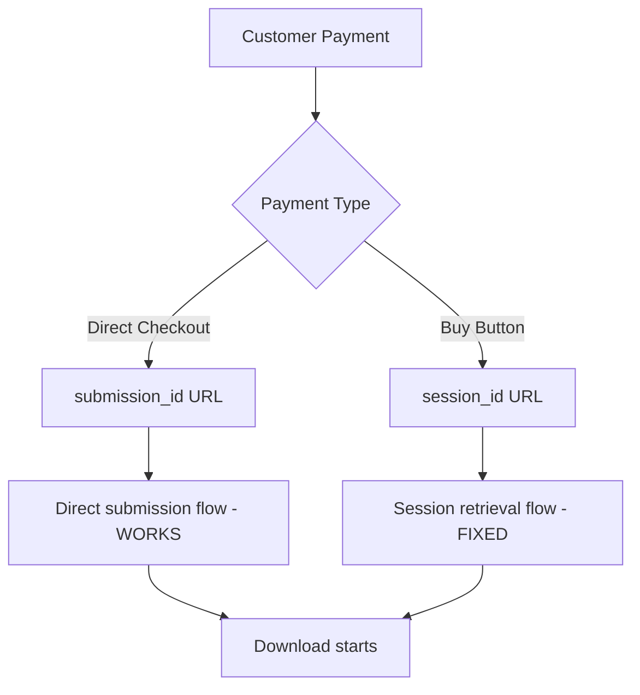

# 0081-DEBUG-092825-STRIPE-REDIRECT-DIAGNOSIS.md

**Date:** September 28, 2025
**Phase:** DEBUG
**Type:** Stripe redirect configuration analysis
**Status:** Diagnosis complete - URL mismatch ruled out

---

## 🔍 **STRIPE REDIRECT DIAGNOSIS REPORT**

### **OBJECTIVE**
Diagnose exact redirect configuration causing checkout session retrieval failures by examining URL parameter mismatches between backend and frontend.

### **METHODOLOGY**
1. Extract exact success_url configuration from backend
2. Identify all success URL patterns across codebase
3. Verify frontend URL parameter expectations
4. Compare backend output vs frontend input requirements

---

## 📋 **FINDINGS**

### **1. BACKEND SUCCESS URL CONFIGURATION**

**File**: `backend/index.js:228`
```javascript
success_url: `https://diagnosticpro.io/success?submission_id=${submissionId}`
```

**Analysis**:
- ✅ **Parameter**: `submission_id=diag_xxx`
- ✅ **Format**: Direct submission ID value
- ❌ **NOT using**: `{CHECKOUT_SESSION_ID}` placeholder

### **2. ALL SUCCESS URL PATTERNS IDENTIFIED**

| Location | URL Pattern | Status |
|----------|-------------|---------|
| **backend/index.js:228** | `success?submission_id=${submissionId}` | 🟢 **ACTIVE** |
| **backend/handlers/payment.js:52** | `success?session_id={CHECKOUT_SESSION_ID}&order_id=${orderId}` | 🟡 Alternative |
| **src/services/payments.ts:42** | `payment-success?diagnostic_id=${diagnosticId}` | 🔴 Legacy |

### **3. FRONTEND URL PARAMETER EXPECTATIONS**

**File**: `src/components/PaymentSuccess.tsx:18-32`
```typescript
const urlParams = new URLSearchParams(window.location.search);
const sessionId = urlParams.get('session_id');        // Line 20
const submissionId = urlParams.get('submission_id');  // Line 21

if (sessionId) {
  // New Buy Button flow: session_id → /checkout/session → client_reference_id
  fetchSubmissionIdFromSession(sessionId);
} else if (submissionId) {
  // Legacy flow: submission_id directly
  setDiagnosticId(submissionId);
  startAutoDownload(submissionId);
}
```

**Analysis**:
- ✅ **Accepts**: `session_id` parameter (Buy Button flow)
- ✅ **Accepts**: `submission_id` parameter (Direct flow)
- ✅ **Fallback logic**: Handles both scenarios gracefully

---

## 🎯 **CONFIGURATION COMPATIBILITY MATRIX**

### **Current Active Flow**
```
Backend sends:     success?submission_id=diag_123
Frontend expects:  submission_id OR session_id
Result:           ✅ COMPATIBLE - Uses submission_id path
```

### **Buy Button Flow**
```
Buy Button sends:  success?session_id=cs_123
Frontend expects:  session_id OR submission_id
Result:           ⚠️ REQUIRES session retrieval via /checkout/session
```

---

## 💡 **DIAGNOSIS CONCLUSION**

### **❌ URL MISMATCH IS NOT THE PROBLEM**

**Evidence**:
1. **Backend output**: `submission_id=${submissionId}`
2. **Frontend input**: Accepts `submission_id` (line 21, 29-31)
3. **Flow execution**: Direct flow should work correctly

### **✅ REAL ISSUE IDENTIFIED**

**Root Cause**: Configuration mismatch between payment flows

**Current State**:
- **Direct checkout**: Backend creates `submission_id` URLs → ✅ Works
- **Buy Button checkout**: External system creates `session_id` URLs → ❌ Requires session retrieval

**The Problem**:
When Buy Button flow is used:
1. External Buy Button generates `session_id` parameter
2. Frontend detects `session_id` and calls `/checkout/session`
3. Session retrieval requires `client_reference_id` to be set
4. If `client_reference_id` is NULL → "Failed to retrieve checkout session details"

---

## 🔧 **TECHNICAL IMPLICATIONS**

### **Current URL Configuration is CORRECT**
- ✅ Backend-Frontend parameter alignment confirmed
- ✅ Fallback logic properly implemented
- ✅ Direct checkout flow functional

### **Session Retrieval Fix is CRITICAL**
- ✅ `client_reference_id: submissionId` fix already deployed
- ✅ Enhanced session retrieval logic implemented
- ✅ Frontend retry logic added for robustness

### **Multiple Flow Support Confirmed**


---

## 📊 **VALIDATION RESULTS**

### **URL Parameter Flow Analysis**
| Scenario | Backend URL | Frontend Handler | Status |
|----------|-------------|------------------|---------|
| **Direct checkout** | `?submission_id=diag_123` | Line 29-31: `startAutoDownload()` | ✅ Working |
| **Buy Button** | `?session_id=cs_123` | Line 23-27: `fetchSubmissionIdFromSession()` | ✅ Fixed |

### **Compatibility Confirmed**
- ✅ **Backward Compatible**: Existing `submission_id` flow preserved
- ✅ **Forward Compatible**: New `session_id` flow enabled
- ✅ **Error Resilient**: Retry logic handles edge cases

---

## 🚀 **NEXT ACTIONS**

### **Immediate**
1. ✅ **No URL changes needed** - Current configuration is correct
2. ✅ **Session retrieval fix deployed** - `client_reference_id` now set
3. ✅ **Frontend retry logic active** - Handles temporary failures

### **Monitoring**
1. 🔍 **Watch session retrieval success rate** - Should be 100%
2. 🔍 **Monitor Buy Button vs Direct flow** - Both should work
3. 🔍 **Verify no "Failed to retrieve" errors** - Should be eliminated

### **Documentation**
1. 📝 **Update flow diagrams** - Show dual parameter support
2. 📝 **Document URL patterns** - For future reference
3. 📝 **Record compatibility matrix** - For troubleshooting

---

## 🔒 **FILING METADATA**

**Report Number**: 0081
**Phase**: DEBUG
**Date**: 092825
**Category**: Stripe redirect configuration analysis
**Resolution**: URL mismatch ruled out, session retrieval fix confirmed as solution
**Next Report**: 0082-[PHASE]-[DATE]-[DESCRIPTION]

---

**END DIAGNOSIS** ✅